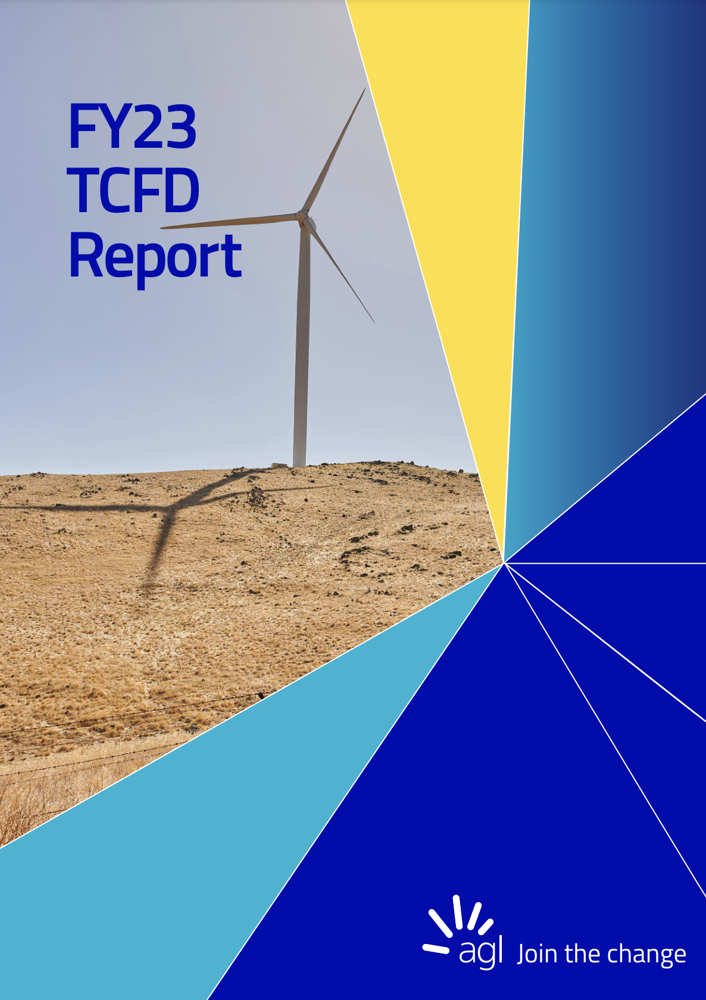

## TCFD Report Analysis using a Local Large Language Model (LLM) and Retrieval Augmented Generation (RAG)

### Summary
In this project I built a StreamLit web application to automate TCFD (Task Force on Climate-related Financial Disclosures) Report Analysis. I use [Meta's Llama2 model](https://ai.meta.com/llama/) and Retrieval Augmented Generation to analyse the PDFs of published TCFD reports and answer a predefined set of 11 questions. The app also displays the source text from the TCFD report and the page number that was passed to the LLM to answer each of the questions, thereby increasing the level of confidence in the veracity of the answers.

### TCFD Overview
The Task Force on Climate-related Financial Disclosures (TCFD) provides a framework to help companies disclose climate-related information to their stakeholders. TCFD reports are pivotal tools that allow organizations to transparently convey their climate-related risks, opportunities, and strategies to stakeholders. Analyzing these reports helps in comprehending a company's climate impact, sustainability efforts, and overall readiness to navigate the challenges posed by climate change.

### Local LLM using Llama2
In
The benefit of RAG is that it helps overcome the issues of traditional generative models, like producing inaccurate or irrelevant responses. By leveraging the retrieval mechanism to provide a foundation of relevant information, the generative component can refine its output, ensuring the text generated is not only fluent and coherent but also aligned with the retrieved information.

### Background
The 2011 Queensland Flood was a devastating natural disaster that occurred in the state of Queensland, Australia. It was triggered by heavy rainfall associated with a monsoon trough and a tropical low-pressure system, resulting in widespread flooding across several regions. The flood, which lasted from late December 2010 to early 2011, caused significant damage to infrastructure, homes, and agricultural land.

### Methodology
To conduct the analysis, I utilised a combination of geospatial datasets. The 2011 flood extent shapefile provided information about the geographic extent of the flood. The GNAF Core dataset, which contains detailed geocoded addresses, enabled me to associate properties with their respective locations. The Queensland Cadastral dataset provided information on property boundaries, while the Local Government dataset contained administrative boundaries for LGAs.

By intersecting the flood extent shapefile with the cadastral dataset, I identified the properties within the flood-affected areas. Using the addresses from the GNAF Core dataset (joined on Land Parcel ID), I determined the LGAs, suburbs, and postcodes associated with these properties. This allowed me to quantify the impact of the flood at a per property level and identify the most affected areas.

### Example
To test the application I used [AGL's FY23 TCFD Report](https://www.agl.com.au/content/dam/digital/agl/documents/about-agl/investors/2023/230810-agl-energy-tcfd-report-2023-5-5.pdf)

#### Pie Chart of Impacted LGAs

#### Impacted LGAs

#### Impacted Postcodes

#### Impacted Suburbs

#### Impacted Properties in Postcode 4064

#### [Raw Data by LGA, Postcode and Suburb](./Assets/Excel/lga_postcode_suburb_counts.xlsx)

### Conclusion
By leveraging geospatial analysis and utilising diverse datasets, this project successfully assessed the impact of the 2011 Queensland Flood. The findings highlight the most affected LGAs, suburbs, and postcodes. This analysis can serve as a foundation for further studies on climate risk and inform decision-making processes aimed at reducing the impact of future floods in Queensland.

### Attribution
- © State of Queensland (Department of Resources) 2023. Updated data available at http://qldspatial.information.qld.gov.au/catalogue// .
- © PSMA Australia Limited trading as Geoscape Australia. ABN 23 089 912 710. Data available at https://geoscape.com.au/data/g-naf-core/ 
- OpenStreetMap® is open data, licensed under the Open Data Commons Open Database License (ODbL) by the OpenStreetMap Foundation (OSMF).
