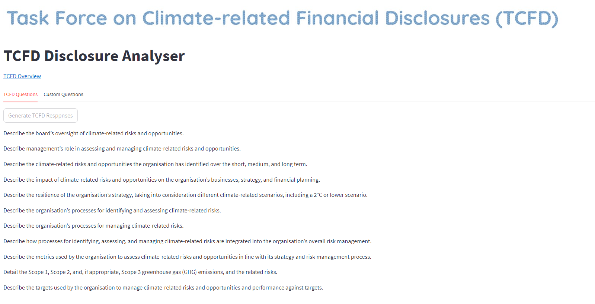

## TCFD Report Analysis using a Local Large Language Model (LLM) and Retrieval Augmented Generation (RAG)

### Summary
For this project I wanted to explore running an LLM locally to analyse a set of locally hosted documents and answer a series of questions. This allows one to use sophisticated AI models in a private without having to use APIs or send data outside the local network. In order to practically apply this technique I built a StreamLit web application to automate analysis of TCFD (Task Force on Climate-related Financial Disclosures) Report Analysis. I used [Meta's Llama2 model](https://ai.meta.com/llama/) and RAG to analyse the TCFD reports through answering a set of 11 predefined questions. The app also displays the source text from the TCFD report (including the page number) that was passed to the LLM to answer each of the questions, thereby increasing the level of confidence in the veracity of the answers.

### TCFD Overview
The Task Force on Climate-related Financial Disclosures (TCFD) provides a framework to help companies disclose climate-related information to their stakeholders. TCFD reports are pivotal tools that allow organizations to transparently convey their climate-related risks, opportunities, and strategies to stakeholders. Analysing these reports helps in comprehending a company's climate impact, sustainability efforts, and overall readiness to navigate the challenges posed by climate change.

### RAG

Retrieval Augmented Generation (RAG) is an framework for improving the quality of LLM generated responses by grounding the LLM in a private knowledge base (Embedding Model and Vector DB in the diagram above). Two main advantages of RAG are:
1. Users can ingest the most authoritative and current source documents to deliver better factual consistency and improve the reliability of the generated responses.
2. Users have access to the model's sources (Retrieval QA Chain in the diagram above), ensuring that the LLM responses can be checked for accuracy against the source documents.

### Example
To test the application I used AGL's FY23 TCFD Report

#### TCFD Web App - UI

#### TCFD Web App - 11 Questions

#### TCFD Web App - Question 1: Answers and Source Text Used

#### TCFD Web App - Question 2: Answers and Source Text Used

#### TCFD Web App - Custom Questions

### Conclusion
By leveraging geospatial analysis and utilising diverse datasets, this project successfully assessed the impact of the 2011 Queensland Flood. The findings highlight the most affected LGAs, suburbs, and postcodes. This analysis can serve as a foundation for further studies on climate risk and inform decision-making processes aimed at reducing the impact of future floods in Queensland.

### Attribution
- © State of Queensland (Department of Resources) 2023. Updated data available at http://qldspatial.information.qld.gov.au/catalogue// .
- © PSMA Australia Limited trading as Geoscape Australia. ABN 23 089 912 710. Data available at https://geoscape.com.au/data/g-naf-core/ 
- OpenStreetMap® is open data, licensed under the Open Data Commons Open Database License (ODbL) by the OpenStreetMap Foundation (OSMF).
