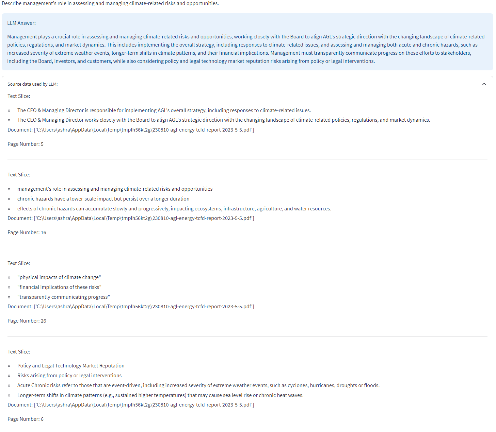

## TCFD Report Analysis using a Local Large Language Model (LLM) and Retrieval Augmented Generation (RAG)

### Summary
For this project I built a StreamLit web application to automate TCFD (Task Force on Climate-related Financial Disclosures) Report Analysis. I used [Meta's Llama2 model](https://ai.meta.com/llama/) and RAG to analyse the TCFD reports and answer a set of 11 predefined questions. The app also displays the source text from the TCFD report (including the page number) that was passed to the LLM to answer each of the questions, thereby increasing the level of confidence in the veracity of the answers.

### TCFD Overview
The Task Force on Climate-related Financial Disclosures (TCFD) provides a framework to help companies disclose climate-related information to their stakeholders. TCFD reports are pivotal tools that allow organizations to transparently convey their climate-related risks, opportunities, and strategies to stakeholders. Analyzing these reports helps in comprehending a company's climate impact, sustainability efforts, and overall readiness to navigate the challenges posed by climate change.

### RAG
Retrieval Augmented Generation (RAG) is a natural language processing (NLP) approach that combines elements of both retrieval-based models and generative models to improve the quality and relevance of generated text. This approach aims to address the limitations of traditional LLMs models by incorporating a retrieval mechanism.
Key components of RAG are as follows:
1.	Retrieval Component: In the retrieval-based component of RAG, a pdf document is loaded,  or corpus of text is indexed, and when given a specific query or prompt, it retrieves relevant passages or documents from this corpus. The retrieval system helps identify and gather information that is pertinent to the context.
2.	Generation Component: The generative component, often based on models like GPT (Generative Pre-trained Transformer), generates text based on the retrieved information and the original query or prompt. It utilizes the retrieved content to inform and improve the generation process, ensuring the produced text is coherent, relevant, and contextually accurate.
3.	Integration of Retrieval and Generation: RAG seamlessly integrates these two components. Initially, it retrieves relevant information based on the input query. Subsequently, it employs this retrieved information to guide and enhance the generative process, enabling the generation of more informed and contextually appropriate responses.
4.	Fine-tuning and Training: The model is fine-tuned using a combination of supervised learning, where the model is trained on human-generated responses, and reinforcement learning, where the model learns from its own generated responses to improve over time.
The benefit of RAG is that it helps overcome the issues of traditional generative models, like producing inaccurate or irrelevant responses. By leveraging the retrieval mechanism to provide a foundation of relevant information, the generative component can refine its output, ensuring the text generated is not only fluent and coherent but also aligned with the retrieved information.

### Background
The 2011 Queensland Flood was a devastating natural disaster that occurred in the state of Queensland, Australia. It was triggered by heavy rainfall associated with a monsoon trough and a tropical low-pressure system, resulting in widespread flooding across several regions. The flood, which lasted from late December 2010 to early 2011, caused significant damage to infrastructure, homes, and agricultural land.

### Methodology
To conduct the analysis, I utilised a combination of geospatial datasets. The 2011 flood extent shapefile provided information about the geographic extent of the flood. The GNAF Core dataset, which contains detailed geocoded addresses, enabled me to associate properties with their respective locations. The Queensland Cadastral dataset provided information on property boundaries, while the Local Government dataset contained administrative boundaries for LGAs.

By intersecting the flood extent shapefile with the cadastral dataset, I identified the properties within the flood-affected areas. Using the addresses from the GNAF Core dataset (joined on Land Parcel ID), I determined the LGAs, suburbs, and postcodes associated with these properties. This allowed me to quantify the impact of the flood at a per property level and identify the most affected areas.

### Example
To test the application I used AGL's FY23 TCFD Report

#### TCFD Web App - UI

#### TCFD Web App - 11 Questions

#### TCFD Web App - Question 1: Answers and Source Text Used

#### TCFD Web App - Question 2: Answers and Source Text Used

#### TCFD Web App - Custom Questions

### Conclusion
By leveraging geospatial analysis and utilising diverse datasets, this project successfully assessed the impact of the 2011 Queensland Flood. The findings highlight the most affected LGAs, suburbs, and postcodes. This analysis can serve as a foundation for further studies on climate risk and inform decision-making processes aimed at reducing the impact of future floods in Queensland.

### Attribution
- © State of Queensland (Department of Resources) 2023. Updated data available at http://qldspatial.information.qld.gov.au/catalogue// .
- © PSMA Australia Limited trading as Geoscape Australia. ABN 23 089 912 710. Data available at https://geoscape.com.au/data/g-naf-core/ 
- OpenStreetMap® is open data, licensed under the Open Data Commons Open Database License (ODbL) by the OpenStreetMap Foundation (OSMF).
