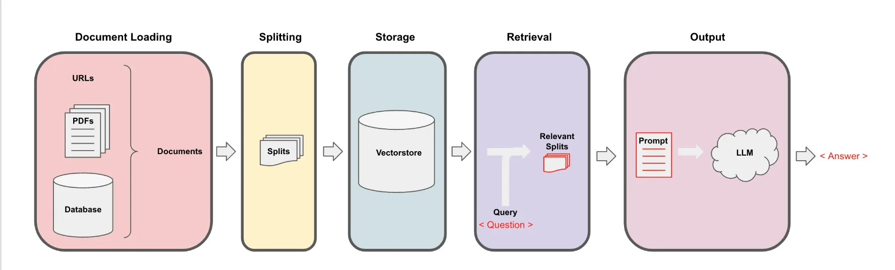

## TCFD Report Analysis using a Local Large Language Model (LLM) and Retrieval Augmented Generation (RAG)

")

[Hover your mouse here to see the tooltip](https://stackoverflow.com/a/71729464/11465149 "This is a tooltip :)")

### Summary
For this project I wanted to explore running an LLM locally to analyse a set of locally hosted documents and answer a series of questions. This implementation allows one to use sophisticated AI models privately, without having to use APIs or send data outside your local network. To ground it a practical use case, I built a Streamlit web application to automate analysis of TCFD (Task Force on Climate-related Financial Disclosures) Reports. I used [Meta's Llama2 model](https://ai.meta.com/llama/) and RAG to analyse the TCFD reports through answering a set of 11 predefined questions. The app also displays the source text from the TCFD report (including the page number) that was passed to the LLM to answer each of the questions, thereby increasing the level of confidence in the accuracy of the answers.

### TCFD
The TCFD provides a framework to help companies disclose climate-related information to their stakeholders. TCFD reports are pivotal tools that allow organizations to transparently convey their climate-related risks, opportunities, and strategies to stakeholders. Analysing these reports helps in comprehending a company's climate impact, sustainability efforts, and overall readiness to navigate the challenges posed by climate change.

### RAG

RAG is a framework for improving the quality of LLM generated responses by grounding the LLM in a private knowledge base (Embedding Model and Vector DB in the diagram above). Two of the main advantages of RAG are:
1. Users can ingest the most authoritative and current source documents to deliver better factual consistency and improve the reliability of the generated responses.
2. Users have access to the model's sources (Retrieval QA Chain in the diagram above), ensuring that the LLM responses can be checked for accuracy against the source documents.

## TCFD Report Analysis Questions
In order to determine the questions used to analyse the reports I utilised the [TCFD’s disclosure recommendations](https://assets.bbhub.io/company/sites/60/2020/10/FINAL-2017-TCFD-Report-11052018.pdf) (across the four topics of governance, strategy, risk management, and metrics and targets) which were summaried in this [Deloitte article](https://www2.deloitte.com/ch/en/pages/risk/articles/tcfd-and-why-does-it-matter.html) into the following 11 items:

### Testing the App on AGL's FY23 TCFD Report
To practially test the application I used AGL's FY23 TCFD Report. [AGL is Australia's largest Scope 1 emitter](https://www.cleanenergyregulator.gov.au/NGER/National%20greenhouse%20and%20energy%20reporting%20data/Data-highlights/2021-22-published-data-highlights) (Scope 1 greenhouse gas emissions are the emissions released to the atmosphere as a direct result of an activity).

#### TCFD Web App - Responses to the first two questions

#### TCFD Web App - Question 1: Answers and Source Text Used

#### TCFD Web App - Question 2: Answers and Source Text Used

#### TCFD Web App - Users Also Have the Ability to Ask Custom Questions

### Conclusion
By leveraging a local LLM and RAG, this project successfully analysed AGL's TCFD report by answering 11 preset questions. The quality of the repsonses and the quoting of the sources used, clearly demostrates the utility and effiecincy gain that this implementation of LLMs provides. 

#### Key Libraries and Resources Used:
- [LangChain🦜️🔗](https://www.langchain.com/)
- [Meta - Llama2](https://huggingface.co/meta-llama)
- [Streamlit](https://streamlit.io/)
- [HuggingFace🤗](https://huggingface.co/)
- [TheBloke - HuggingFace](https://huggingface.co/TheBloke)

